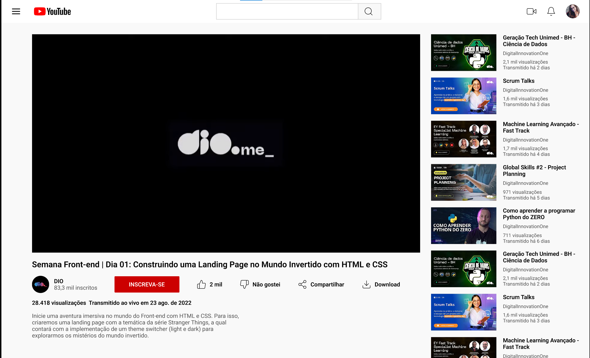

# Desafio 02: Clonando a Página do Youtube com CSS

Este foi o segundo desafio da Trilha de CSS da DIO! 
Neste Desafio clonamos a página do YouTube com CSS colocando em prática todos os conceitos aprendidos, principalmente sobre Flexbox.

[Clique aqui](https://eloizaams.github.io/dio-trilha-css-desafio-02/) para acessar o resultado final da Landing Page criada a partir do desafio!

[Link do Figma](https://www.figma.com/design/lrRWUZPKnqMDZrSDJmZxUS/Desafio-de-Flexbox---DIO?node-id=1-2&node-type=frame&t=OQ21Zf969bjvW9Zq-0) contendo o protótipo do desafio.

